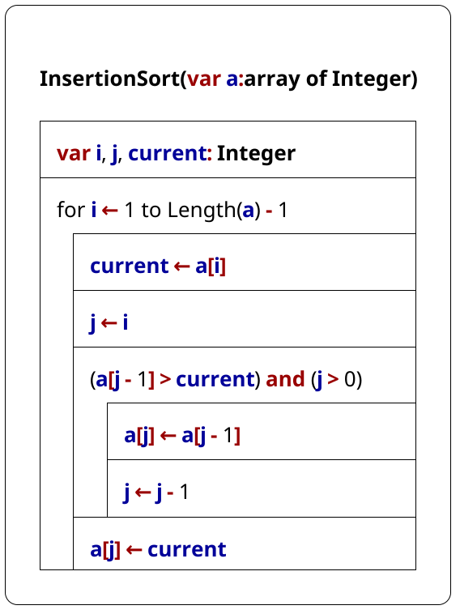
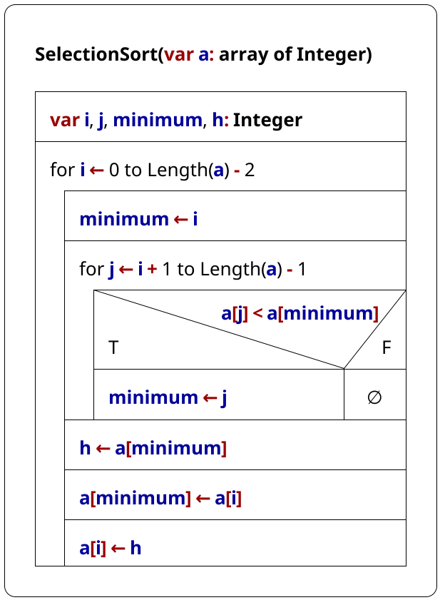
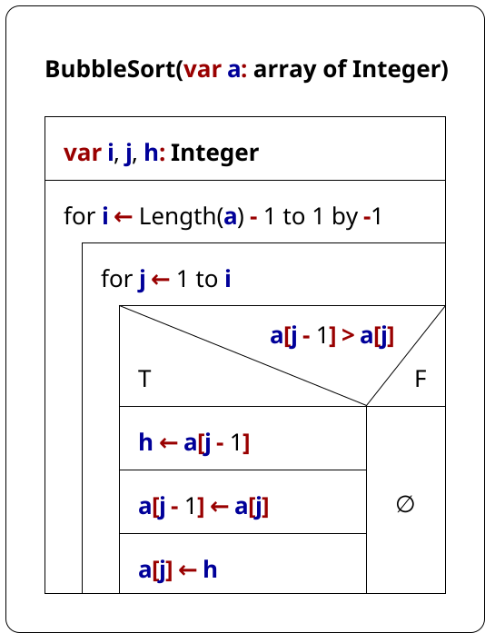
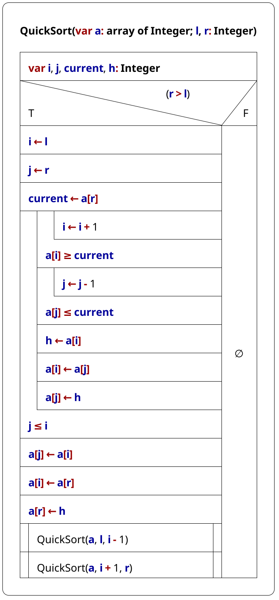

# Sorting Algorithms

## Insertion Sort

```delphi
procedure InsertionSort(var a: array of Integer);
var
    i, j, current: Integer;
begin
    for i := 1 to Length(a) - 1 do
    begin
        current := a[i];
        j := i;
        while (a[j-1] > current) and (j > 0) do
        begin
            a[j] := a[j-1];
            j := j - 1;
        end;
        a[j] := current;
    end;
end;
```



## Selection Sort

```delphi
procedure SelectionSort(var a: array of Integer);
var
    i, j, minimum, h: Integer;
begin
    for i := 0 to Length(a) - 2 do
    begin
        minimum := i;
        for j := i + 1 to Length(a) - 1 do
        begin
            if a[j] < a[minimum] then
                minimum := j;
        end;
        h := a[minimum];
        a[minimum] := a[i];
        a[i] := h;
    end;
end;
```



## Bubble Sort

```delphi
procedure BubbleSort(var a: array of Integer);
var
    i, j, h: Integer;
begin
    for i := Length(a) - 1 downto 1 do
    begin
        for j := 1 to i do
            if a[j-1] > a[j] then
            begin
                h := a[j-1];
                a[j-1] := a[j];
                a[j] := h;
            end;
    end;
end;
```



## Quicksort

```delphi
procedure QuickSort(var a: array of Integer; l, r: Integer);
var
    i, j, current, h: Integer;
begin
    if (r > l) then
    begin
        i := l;
        j := r;
        current := a[r];
        repeat
            repeat
                i := i + 1;
            until a[i] >= current;
            repeat
                j := j - 1;
            until a[j] <= current;
            h := a[i];
            a[i] := a[j];
            a[j] := h;
        until j <= i;
        a[j] := a[i];
        a[i] := a[r];
        a[r] := h;
        QuickSort(a, l, i - 1);
        QuickSort(a, i + 1, r);
    end;
end;
```


